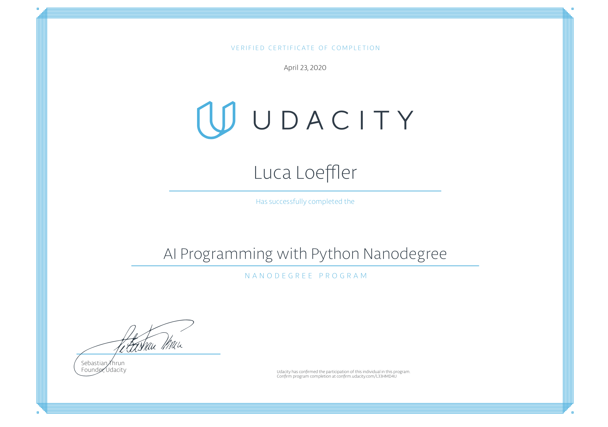

# Data-Science Repository 
Hey,
thanks for checking out my Data Sience Repository!
Here I am collectting all my work that I have done so far. 

## AI Programming with Python Nanodegree

Project code for Udacity's AI Programming with Python Nanodegree program. In this project, students first develop code for an image classifier built with PyTorch, then convert it into a command line application. The command line application consists of two parts. In the first part is an application to train the AI and the second part is used to predict an image based on the trained network.

You can have a look at the curriculum here[https://d20vrrgs8k4bvw.cloudfront.net/documents/en-US/Artificial+Intelligence+with+Python+Nanodegree+Syllabus+9-5.pdf].

## Tools
...
### NumPy
...
### Pandas
...
### Seaborn
...
## Data Visualization Nanodegree

Check out my Dashbaords on my Tableau Public Account:
https://public.tableau.com/profile/luca.loeffler#!/?newProfile=&activeTab=0

You can have a look at the curriculum here
https://www.udacity.com/course/data-visualization-nanodegree--nd197

